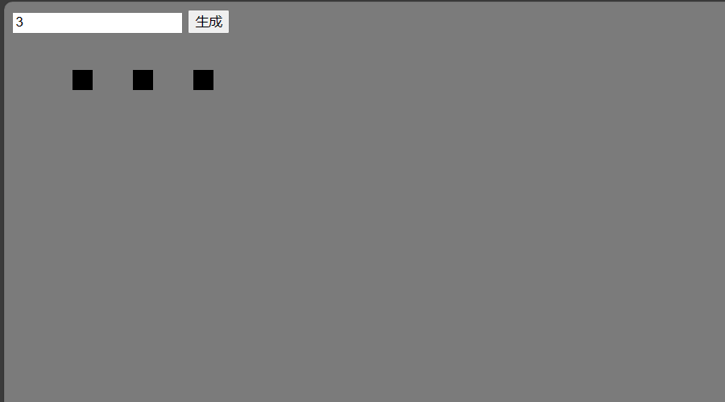
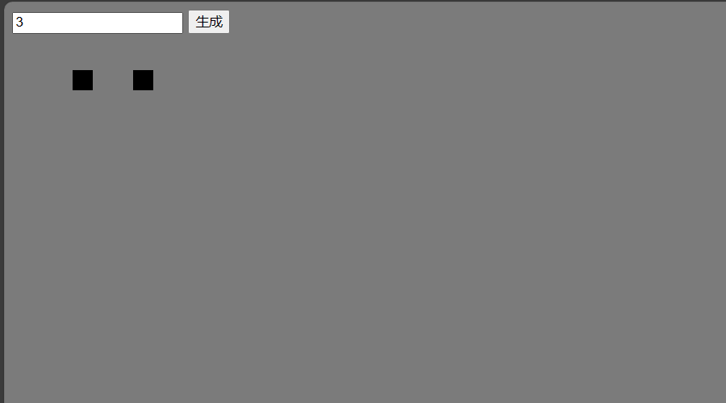
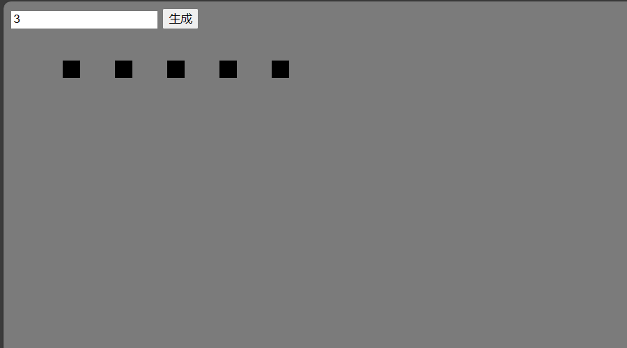

# 技术小组2025年纳新试题

正如协会的纳新原则一样，技术小组的纳新也是重点考察大家对于技术的热情、即时学习能力以及面向文档的学习能力。下面的题目不需要大家有多少基础，我们会欣赏大家努力解题的过程。

以下共有8题，题目难度和类型也不相同，你可以按照自己的情况选取若干题目完成，三至四题即可。**其中第0题包含了题目解答上传的途径，因此必须完成。** 在解题开始前，**请先完成第0题的第0步**。但你可以在提交之前的任何时候完成这道题的剩余部分，**可以先把后面的题目完成**。 在解题过程中，你可以搜索相关资料，但请不要与其他人交流。

现在，AI技术发展得很快。我们不禁止大家使用AI完成任务，使用AI有效地完成任务也是一种能力。但请在提交中注明哪些部分是借助AI完成的。

如果在努力尝试后仍未能完全解答，可以谈一谈你对这些题目的理解，也可以将你对题目的探索过程作为附件提交，我们会酌情加分。

Have fun coding~

## 0.来签到啦！ - Git

作为一位（准）开发人员，你会遇到很多很多与他人合作完成项目的场景。你也许听说过“这个项目我Fork了”“这个项目我Star了”“我提交了一个PR”这样的说法，其实这都与Git息息相关。

Git 是一个开源的分布式版本控制系统，用于敏捷高效地处理任何或小或大的项目。它是 Linus Torvalds 为了帮助管理 Linux 内核开发而开发的一个开放源码的版本控制软件。

在 [First Contributions](https://github.com/firstcontributions/first-contributions) 这个仓库中，作者介绍了 Git 的基本操作。你也可以通过询问 AI、搜索资料等来学习使用 Git。

### 你的任务

0. 联系QQ群里发布题目的ldx，向他要一份RSA公钥。
1. 在代码托管平台（如 [GitHub](github.com)、[Gitee](gitee.com)）上新建一个远程 Git 仓库，用于提交你的作答，我们在后面叫它 `答题仓库`。**（仓库的结构：最外层放一个`README.md`文件，必须包含你的部门和姓名，可选提交一份和技术有关的自我介绍；之后每一题新建一个文件夹，将文件放在里面；请将仓库设为公开）**
2. 在电脑上安装并配置好 `Git`。Windows 系统建议在 `WSL` 中安装。Linux 和 Mac OS 上直接安装即可。
3. `Fork` 这个[`提交仓库`](https://github.com/zjjncsn/2025-evatech-joinus-submit-internal)（如果 GitHub 无法打开，可将链接中的 `github.com` 改为 `gitee.com` 后访问）。
4. 将其 `clone` 到本地，新建一个分支，名称随意（命令行clone以后可以使用 Visual Studio Code 打开这个文件夹，简化操作。但我们推荐初学者使用命令行完成 Git 相关的全部操作）。
5. 在**提交仓库**的 `submissions` 文件夹下新建一个名为 `<你的昵称>.md` 的文件，在里面放入你第一步新建的**答题仓库**进行 **RSA加密后** 的链接。
```
可以使用在线加密/解密网站，参数如下。
密钥长度：2048位
明文格式：string/utf-8
填充方式：PKCS#1
密文格式：Base64
不用担心错误的设置导致无法解密，遇到无法解密的链接我们会主动联系你。
```
6. `提交` 你所做的更改，并将其 `上传` 至远程仓库
7. 在托管平台上进行 `Pull Requests`。

如果你成功完成了以上所有步骤，那么恭喜你完成了第0题的全部内容。接下来你只需要在**答题仓库**中解答剩下的题目即可。

如果你在途中遇到了困难，可以随时联系我们。如果确实无法使用上面的方法提交，可以采用以下三种替代方法（不推荐）：

- 在[**提交仓库**](https://github.com/zjjncsn/2025-evatech-joinus-submit-internal)中新建一个 `issue`，在里面放上你的**答题仓库**进行RSA加密后的链接。

- 将你的代码打包之后发到邮箱 `zjjncsn@163.com`。

- 将你的代码通过QQ发送给我们（非常不推荐）。

## 1. Linux

对于0基础的同学来说，电脑操作系统大概率是 Windows 的。

然而，服务器上，Linux的各种发行版因为资源开销更小，被更广泛地使用。

### 你的任务（简单版）

如果你已经熟练掌握 Linux，可以直接跳到附加题后面的题目。

- 使用各种方法（包括但不限于WSL、虚拟机、双系统、云服务器）开启一个Linux系统
- 输出系统信息并复制到文本文件，上传答题仓库
- 理解Linux的目录结构，用自己的话讲讲一些常见目录有什么用处（例如：~、/etc、/bin）
- 在家目录下新建一个文件夹，并截图记录

**附加题**

- （如果是本地运行的WSL/虚拟机）将系统配置成可ssh登录
- 配置密钥对，使得系统可以无密码登录
- 将操作要点和ssh的截图上传至答题仓库

**如果这些对你来说都是小菜一碟**

- 访问[这个链接](https://pan.zju.edu.cn/share/550dcef38f1d852c3e672c56bd) 访问密码：zjueva，下载一个镜像。
- 使用虚拟机启动镜像中包含的系统
- 使用用户`zjueva`和密码`zjueva`登录
- 在该用户的家目录下有个 OpenSSH 格式的私钥，私钥的口令（passphrase）是`zju3va`，使用这个私钥通过SSH登录镜像中的Root用户
- 在`/root`中，找到`secret.txt`，将其中的内容和你在前面进行的操作写进文档，上传至答题仓库
- 在镜像的根目录下有个名为`secretfile`的文件，这是一个 LUKS 加密的，包含单个 ext4 格式分区的磁盘镜像，请尝试挂载这个镜像并读取里面的文件，将文件内容和你进行的操作上传至答题仓库。LUKS 口令为`170826`

提示：

对于熟练掌握 Linux 的同学们来说，以上路径可能不是最简单的方案。


## 2. 集装箱? - Docker

[Docker](www.docker.com)是一种容器化技术，可以快速构建、测试和部署应用程序，相比于传统的运维，使用Docker可以解决“为什么在我的机器上跑得起来，在你的机器上不行呢？”等等一系列问题，同时也能够充分利用系统资源。当有一个DockerFile的时候，甚至不用去了解项目就可以部署它，那么，这么好用的东西...

### 你的任务
1. 安装Docker（Windows, Linux都可）
2. 下载题目的[附件文件夹](/Appendices/1)到本地，尝试构建镜像并运行，将输出保存到文本文件里。
3. 使用Docker启动一个CentOS，尝试挂载卷，并截图记录。
4. 使用Docker启动一个MySQL服务，并映射端口，截图记录。
5. 将以上文件上传至答题仓库。

### 一些可能需要用到的命令： 
-  `docker build`：使用Dockerfile构建镜像
-  `docker images`：列出本地镜像
-  `docker ps`：列出Docker容器
-  `docker run`：创建并启动一个新的容器
-  `docker start/stop/restart`： 启动/停止/重启容器

相关的教程可以参考：
[Docker教程](http://www.dockerinfo.net/document "Docker教程")
[ZJU Mirror - Docker CE](https://mirror.zju.edu.cn/docs/docker-ce/)

## 3. 学个新语言？ - Zig

[Zig](https://ziglang.org)是一个比较冷门的编程语言，你大概率没有听说过，也更没有学习过它。因此，我们只要求你用它实现一个非常简单的功能：一个让用户猜`[0, 100)`的整数的小游戏。


### 你的任务

下载并安装 Zig 编译器

根据 [Zig 文档](https://ziglang.org/documentation/0.15.1/)、[Zig语言圣经](https://course.ziglang.cc/) 尽你所能完成这个小游戏，将最终代码和可执行文件提交至仓库。如果你最终没能完成这个任务，你也可以将你已完成的部分提交上来，并附上你遇到的问题与猜想的可能的解决方案。

## 4. 网页小实践 - Frontend

请制作一个本地网页，实现一些简单的效果。要求如下：

> 功能要求：

-   这个网页有一个文本输入框和一个按钮，按钮上写着“生成”字样
-   在文本框中输入一个数字，按下“生成”按钮，下方会生成对应数量的小方块，小方块从左至右，从上至下以一定间距排列
-   左键点击小方块可以消除该小方块，其他小方块顺位排列填补空缺
-   在已经有生成小方块的情况下点击“生成”按钮，会在原有基础上增加相应数量的小方块

> 外观样式要求：

-   没有硬性要求，当然我们鼓励你按自己想法装饰网页

> 文件组织要求：

-   采用外置的JavaScript脚本和CSS层叠样式表
-   最终应该提交一个文件夹，内含一个.html文件，.css文件，一个.js文件。

***

样例：

1.  网页刚刚加载&#x20;


1.  在文本框中输入"3"并点击"生成"按钮



1.  左键单击最左侧的小方块&#x20;



1.  再次点击"生成"按钮



***

一些可能有助于完成项目的小提示：

-   小方块的长相和排列方式可以通过修改HTML元素"li"的样式获得
-   左键小方块使其消失的功能，需要在生成小方块时对每个小方块注册"onclick"事件
-   你可能需要学习一些基础的HTML、JS、CSS的语法，可以考虑参考[这个网站](https://www.runoob.com/ "这个网站")上的教程

## 5. 随便写点什么 - Backend

本题语言不限，你可以选择你自己熟悉的语言编写。

如果没有熟悉的语言，可以考虑使用 Python、C#、Go、Node.js 进行编写。

### 你的任务

编写一段后端代码，让它在请求的时候能做出响应。将代码上传至仓库。

**响应格式**

以json的格式返回。

```json
{
    "code": 200, // 状态码，可参考“HTML状态码”
    "status": "OK", // 状态说明，如果出错可以在这里写错误类型
    "data": {
        // 数据正文在此处编写
    }
}
```

在后续的具体任务中，**返回**的格式默认是 `data` 字段中的内容。

**具体任务**

1. Ping

    请求：`[GET]` /ping

    返回：
    ```json
    {
        "msg": "pong"
    }
    ```

2. 计算器

    请求： `[POST]` /calc
    ```json
    {
        "num1": 19,
        "num2": 84,
        "op": 1 
        // op代表所需要的运算，1 - 加；2 - 减；3 - 乘；4 - 除
        // 如果出现了1-4之外的操作，或出现了除数为0，可以换一个状态码，并返回空值
    }
    ```

    返回：
    ```json
    {
        "res": 103
    }
    ```

3. 生日查询

    请求：`[GET]` /birth?name=Alan （可以自行多编几组数据~）

    返回：
    ```json
    {
        "name": "Alan",
        "birthday": 20061007
    }
    ```

    **附加题**

    将姓名和生日使用数据库进行存储；

    使用Post格式传输数据，需要校验姓名之外的内容才返回（如一个编号/手机号/邮箱）

4. 其他

    如果你有什么有意思的后端实现也可以放在这里~

## 6. Bot

技术小组的同学们不想再做智能人工了，他们在为如何向每一个人发送通知而苦恼。这时候，有个同学想了一个点子：“我们可以做个人机”

### 你的任务

编写一个机器人，可以进行简单的指令回应，将代码上传至仓库。

#### 示例

发送 `/你是谁`

回应 `你好呀，我是小e`

发送 `/日期`

回应 `今天是2025年10月x日`

以及其他你想完成的工作

#### 提示

现在有很多平台原生支持机器人，比如 `QQ频道`、`钉钉`、`飞书`、`Telegram`。

你也可以注册一个QQ小号，使用第三方的客户端（记得写随机延时，回应太快有被封号的风险）

使用原生机器人时，你可以直接调用官方的API。当然，我们更推荐搜索合适的框架，会让开发更容易。可以上 GitHub 平台搜索“聊天平台 bot”，如“QQ bot”

在上传代码时，请隐去机器人的例如Appid、Token等内容，防止你的机器人被滥用。

## 7. Server - Nginx

Nginx 是一款轻量级 Web 服务器 / 反向代理服务器。协会绝大多数网络服务都和它有关。

### 你的任务

- 在一个地方安装 Nginx，这个地方可以是云服务器，也可以是你自己的电脑，可以是Wsl，可以是虚拟机，可以是 Docker。
- 编写 nginx.conf，实现一个静态网页，端口不限
- 将编写好的 nginx.conf 上传至仓库

### 附加题

- 为对应站点添加 https 支持
- 将静态网页变为动态网页

## X. 喜欢您来 - And You

感谢你看到这里！

如果你有什么觉得足够有趣，并且实现难度等同或超过上述题目的项目，我们也非常欢迎你自行提交项目仓库链接与项目说明。

期待你的表现！